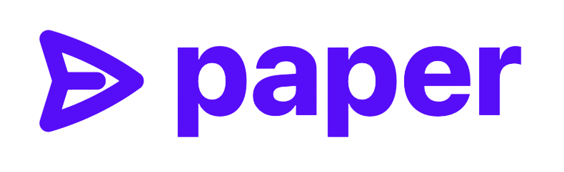

<p align="center"></p>

## Introduction

This is the source code of  [paper.mary-ui.com](https://paper.mary-ui.com) built with [maryUI](https://mary-ui.com).

## All demos

See at https://mary-ui.com/docs/demos.

## Sponsor

Let's keep pushing it, [sponsor me](https://github.com/sponsors/robsontenorio) ❤️

## Follow me

[@robsontenorio](https://twitter.com/robsontenorio)

## Install

This demo is made with Laravel, Livewire, Volt and Mary.

Clone the repository.

```bash
git clone git@github.com:robsontenorio/paper.mary-ui.com.git
```

Create the `.env` from `.env.example`.

```bash
cp .env .env.example
```

Install, migrate and start.

```bash
# See `composer.json`
composer start
```

**Done! See http://localhost:8016**
